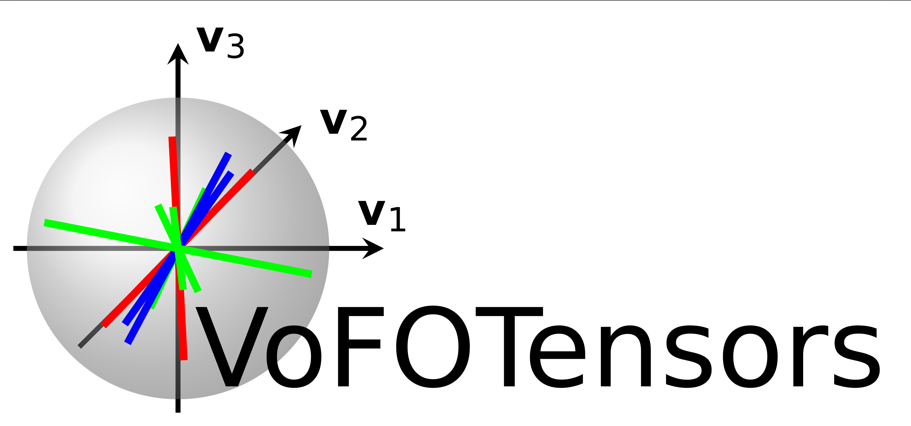

[][url_pypi_this_package]
[](LICENSE)
[](https://zenodo.org/badge/latestdoi/356695831)
[](https://www.python.org/)
[](https://github.com/psf/black)
[](https://mybinder.org/v2/gh/JulianKarlBauer/fiber_orientation_tensors_2021/HEAD)

<p align="center">
  <a href="https://github.com/JulianKarlBauer/fiber_orientation_tensors_2021">
  
  </a>
</p>

# V(ariety) o(f) F(iber) O(rientation) Tensors

This repository contains a Python package called `vofotensors`  
which contains most of the parameterizations of fiber orientation tensors
defined in the paper

```bibtex
@article{doi:10.1177/10812865211057602,
	author = {Julian Karl Bauer and Thomas Böhlke},
	title ={Variety of fiber orientation tensors},
	journal = {Mathematics and Mechanics of Solids},
	volume = {0},
	number = {0},
	pages = {10812865211057602},
	year = {0},
	doi = {10.1177/10812865211057602},
	URL = {https://doi.org/10.1177/10812865211057602},
	eprint = {https://doi.org/10.1177/10812865211057602}
}
```

Please see [license][url_license],
[acknowledgment](#acknowledgment)
and cite the [paper given above][url_mms_article] and the latest [Zenodo-DOI][latest_doi].

## Installation

### Install directly from github
```
python -m pip install git+https://github.com/JulianKarlBauer/fiber_orientation_tensors_2021.git
```

### Install from local clone
- [Clone][url_how_to_clone] this repository to your machine
- Open a terminal and navigate to your local clone
- Install the package from the local clone into the current [env][url_env_python]i[ronment][url_env_conda] in develop mode:
	```shell
	python setup.py develop
	```

Note: [Develop vs. install](https://stackoverflow.com/a/19048754/8935243)

## Examples

Both example notebooks and example scripts are given [here](examples/).

## Acknowledgment

The research documented in this repository has been funded by the German Research Foundation (DFG) within the
International Research Training Group [“Integrated engineering of continuous-discontinuous long fiber reinforced polymer structures“ (GRK 2078)][grk_website].
The support by the [German Research Foundation (DFG)][dfg_website] is gratefully acknowledged.

[grk_website]: https://www.grk2078.kit.edu/
[dfg_website]: https://www.dfg.de/
[latest_doi]: https://zenodo.org/badge/latestdoi/356695831
[url_mms_article]: https://journals.sagepub.com/doi/full/10.1177/10812865211057602
[url_license]: LICENSE

[url_how_to_clone]: https://docs.github.com/en/repositories/creating-and-managing-repositories/cloning-a-repository

[url_env_python]: https://docs.python.org/3/tutorial/venv.html
[url_env_conda]: https://docs.conda.io/projects/conda/en/latest/user-guide/tasks/manage-environments.html

[url_pypi_this_package]: https://pypi.org/project/vofotensors/
